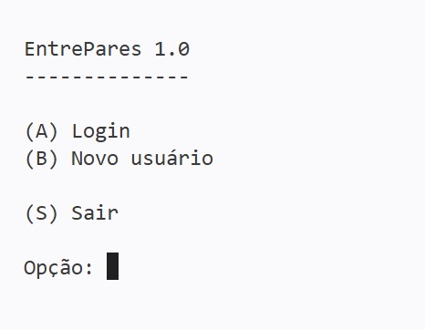
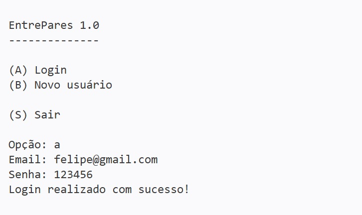
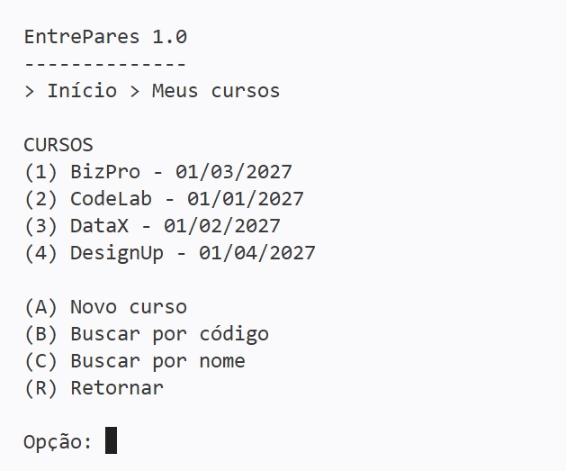
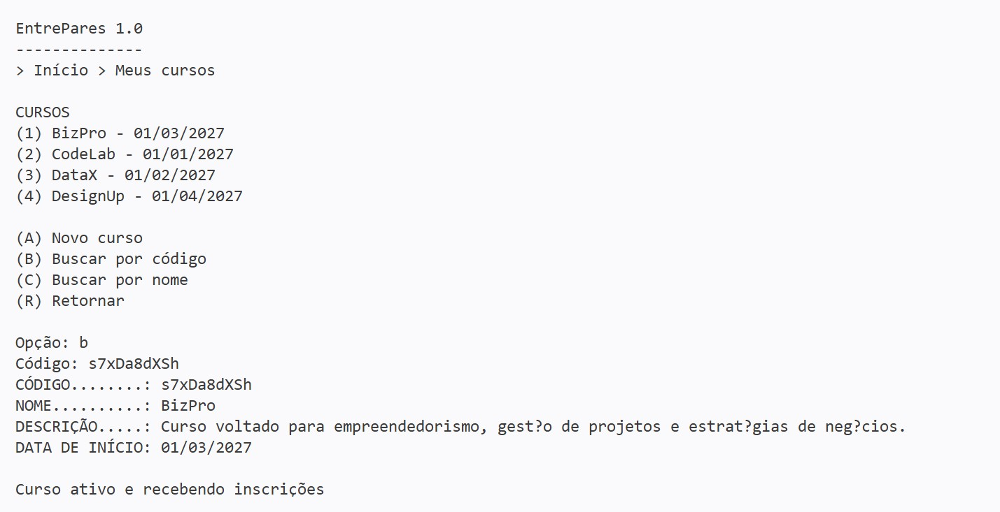
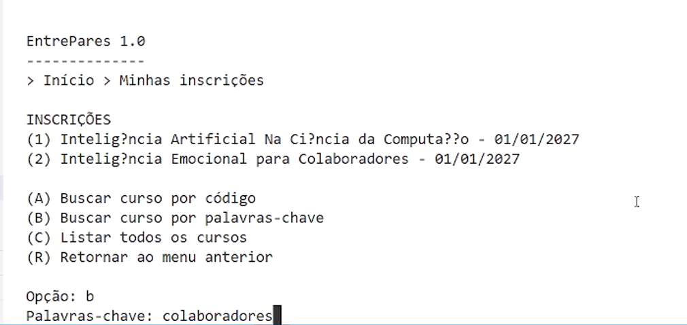
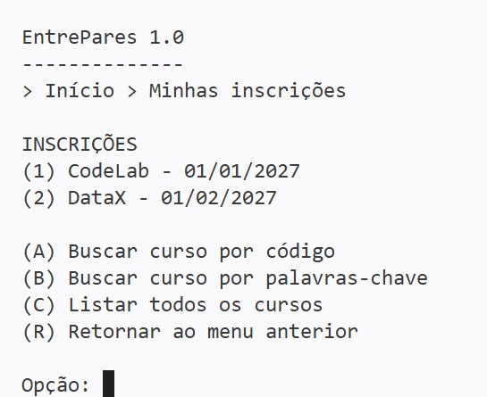
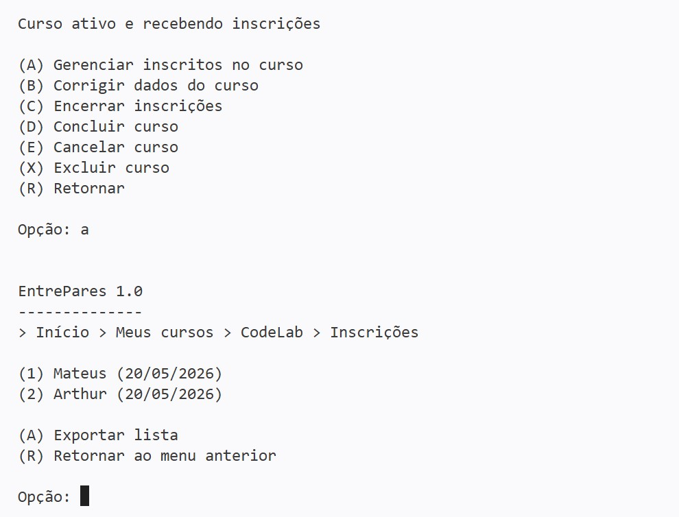

# 📚 Trabalho Prático – AEDs III (TP3)

## 👥 Participantes

* Arthur Campos Pereira
* Felipe Barros Silva
* Mateus Martins Parreiras

---

# 🧾 Descrição do Sistema

O sistema permite o gerenciamento de usuários, cursos e inscrições.

As principais funcionalidades são:

* cadastro e autenticação de usuários;
* cadastro e gerenciamento de cursos;
* inscrição e cancelamento de inscrições;
* busca de cursos por código compartilhável (NanoID);
* busca de cursos por palavras-chave utilizando índice invertido;
* gerenciamento de inscritos nos cursos;
* exportação da lista de inscritos em CSV.

A busca por palavras utiliza índice invertido com cálculo TFxIDF para ordenar os resultados por relevância.

---

# 🖥️ Capturas de Tela

## Tela Inicial

## Cadastro de Usuário

## Menu Meus Cursos

## Busca por Código NanoID

## Busca por Palavras-Chave

## Menu Minhas Inscrições

## Lista de Inscritos

---

# 🧱 Classes Criadas

## Entidades

* Usuario
* Curso
* CursoUsuario

## Arquivos

* ArquivoUsuario
* ArquivoCurso
* ArquivoCursoUsuario

## Menus

* MenuUsuario
* MenuCursos
* MenuInscricoes

## Estruturas Utilizadas

* ListaInvertida
* HashExtensivel
* ArvoreBMais

---

# ⚙️ Operações Especiais Implementadas

* Relacionamento N:N entre usuários e cursos.
* Busca por código NanoID.
* Busca por palavras-chave usando índice invertido.
* Ordenação dos resultados por TFxIDF.
* Atualização automática do índice invertido em inclusões, alterações e exclusões de cursos.
* Exportação da lista de inscritos em formato CSV.
* Bloqueio de inscrições duplicadas.

---

# ✅ Checklist

## O índice invertido com os termos dos nomes dos cursos foi criado usando a classe ListaInvertida?

Sim.

## É possível buscar cursos por palavras no menu de inscrição?

Sim.

## O trabalho compila corretamente?

Sim.

## O trabalho está completo e funcionando sem erros de execução?

Sim.

## O trabalho é original e não a cópia de um trabalho de outro grupo?

Sim.

---

# 🎥 Vídeo de Demonstração

https://youtu.be/SEU_LINK_AQUI
